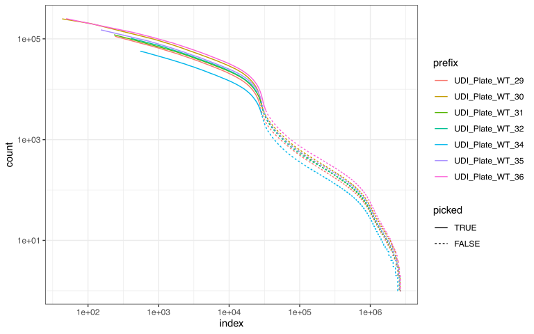

# Debarcoding and sharding

First set up your Zorn/Bascet working directory as before. If you wish
to run these steps on a SLURM cluster, see separate vignette and adapt
accordingly.

``` r
library(Zorn)
bascetRunner.default <- LocalRunner(direct = TRUE, showScript=TRUE)
bascetInstance.default <- getBascetSingularityImage(storeAt="~/") #Assuming Linux
bascetRoot <- "/home/yours/an_empty_workdirectory"
```

The first step in data processing is take the raw FASTQ files and
identify which read belongs to which cell. Zorn can automatically figure
out which files to use for what:

``` r
rawmeta <- DetectRawFileMeta("/home/yours/directory_with_raw_fastq")
```

Depending on your input data, rawmeta might look like this:

| prefix          | r1                                       | r2                                       | dir                                          |
|:----------------|:-----------------------------------------|:-----------------------------------------|:---------------------------------------------|
| UDI_Plate_WT_29 | UDI_Plate_WT_29_S43_L007_R1_001.fastq.gz | UDI_Plate_WT_29_S43_L007_R2_001.fastq.gz | /home/m/mahogny/mystore/dataset/250611/fastq |
| UDI_Plate_WT_29 | UDI_Plate_WT_29_S43_L008_R1_001.fastq.gz | UDI_Plate_WT_29_S43_L008_R2_001.fastq.gz | /home/m/mahogny/mystore/dataset/250611/fastq |
| UDI_Plate_WT_30 | UDI_Plate_WT_30_S44_L007_R1_001.fastq.gz | UDI_Plate_WT_30_S44_L007_R2_001.fastq.gz | /home/m/mahogny/mystore/dataset/250611/fastq |
| UDI_Plate_WT_30 | UDI_Plate_WT_30_S44_L008_R1_001.fastq.gz | UDI_Plate_WT_30_S44_L008_R2_001.fastq.gz | /home/m/mahogny/mystore/dataset/250611/fastq |

Example input file metadata

Prefix is the name of the library, of which there are two here. Note the
paired input FASTQ files R1 and R2. Zorn has here detected that the
libraries were sequenced on two separate lanes; by using the same
prefix, these will be merged during the later sharding stage. Keeping
input files from different lanes separate enables each FASTQ file to be
processed on a separate computer and can thus be advantageous if you
have large amounts of data.

If you have files that are awkwardly named for some reason, simply
produce a data frame with the columns above, and provide as input for
the next stage.

You can now parse the reads the figure out which cell they belong to,
and any UMI information. The only thing you additionally need to specify
is what type of data you have, where “atrandi_wgs” is for the Atrandi
SPC-based MDA protocol for WGS.

Note that Bascet performs trimming of reads during the GetRaw stage.
This includes: \* For RNA-seq: PolyA trimming and trimming at adapters
\* For Atrandi WGS: A specialized algorithm to detect overlap and remove
adapters accordingly Regular users should thus not need to worry about
this

[(SLURM-compatible
step)](https://henriksson-lab.github.io/zorn/articles/slurm.md)

``` r
BascetGetRaw(
    bascetRoot, 
    rawmeta,
    chemistry="atrandi_wgs"
)
```

After debarcoding, you now need to (1) merge files belong to the same
library, and (2) remove reads belonging to empty droplets. Furthermore,
at this step you can also decide to split the cells across multiple
“shards”, enabling parallel processing the data in later steps. This
done in two steps, in which you first set up a “plan”. This is done
using the following command:

``` r
debstat <- PrepareSharding(
  bascetRoot,
  inputName="debarcoded",
  minQuantile=0.95                         #Lower number keeps more cells; do more thorough filtering later
)
```

Before you proceed, you should perform a kneeplot analysis to see which
cells you keep:

``` r
DebarcodedKneePlot(
  debstat,
  filename = "kneeplot.pdf" #optional
)
```

This is just a histogram of reads per barcode. (downsampling for speed
causes cells of low indices to not be shown, worry not!) The diagram
however tells you \* how many cells you have \* how much free-floating
RNA/DNA you have in your background (empty droplets/SPCs) \* how
distinct cells are from background

An example kneeplot for Parse biosciences RNA-seq data is shown below.
You want to to include slightly more cells than the knee indicates. For
Atrandi microbial WGS data, knee plots cannot be trusted, and you may
want a fair bit more to account for lysis differences (see our
manuscript). Including too many cells will slow down later steps but you
can reduce the number of cells at any point. Adjust the cutoff using the
previously set minQuantile parameter.



Kneeplot

Once you have a plan you are happy with, you can proceed with
shardification. At this step you can also choose to create multiple
shards. This is only relevant if you wish to parallelize the workflow
using SLURM, as the number of shards decides how many nodes you can use
in parallel. If you run everything on your own computer then we advise
only creating one shard, as there is no benefit to having multiple and
it is more likely to cause mistakes.

[(SLURM-compatible
step)](https://henriksson-lab.github.io/zorn/articles/slurm.md)

``` r
BascetShardify(
  debstat,
  numOutputShards = 10 #Shards per library; increase to spread the workload over more computers
)
```

## Onward

If you make it here then you have passed one of the heaviest and most
critical steps in the workflow!

How you proceed depends on your use case. If you are doing single-cell
metagenomics of a sample of unknown composition then we recommend the
KRAKEN2 workflow next.

Advanced users may wish to get FASTQ files as input for other tools.
[(SLURM-compatible
step)](https://henriksson-lab.github.io/zorn/articles/slurm.md)
